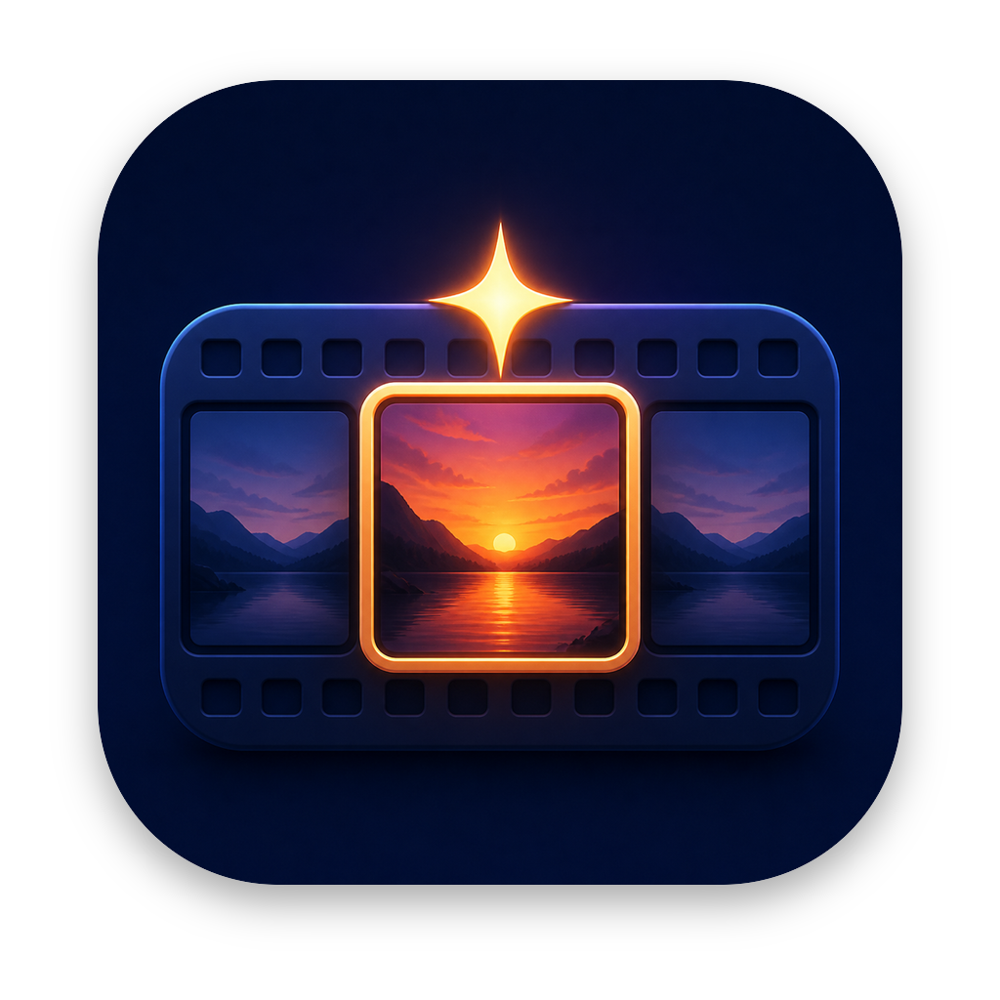
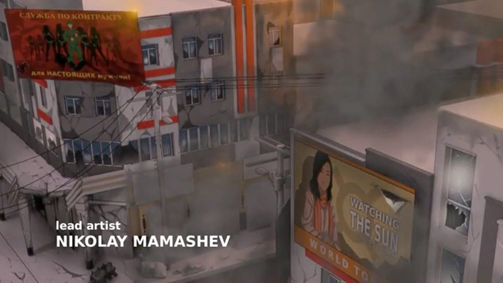
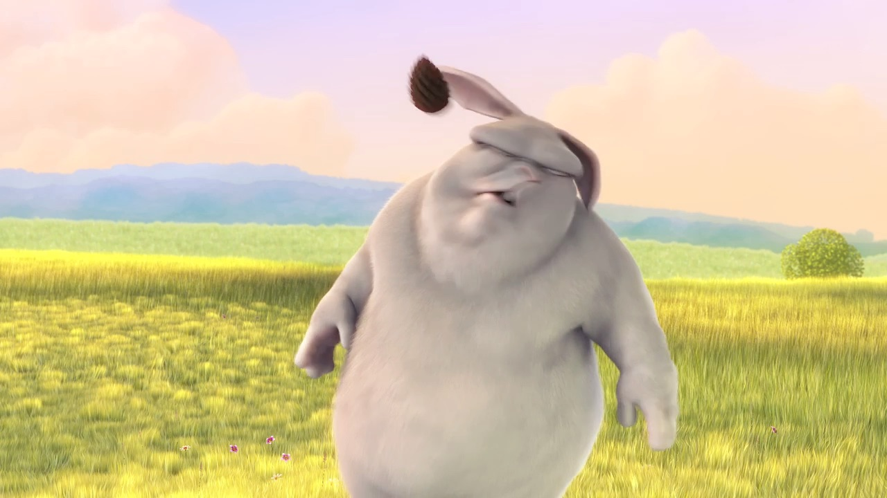
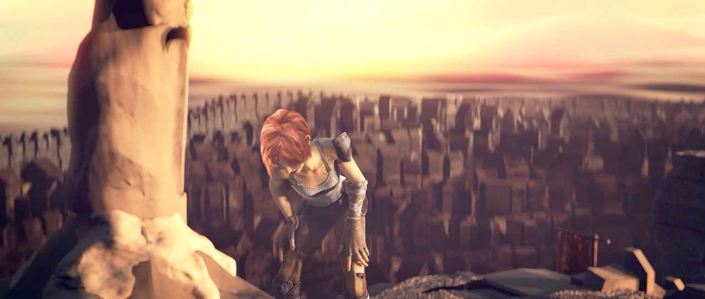
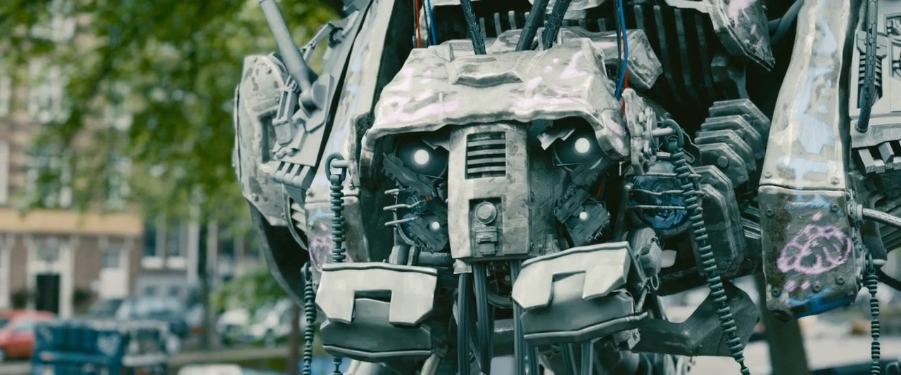
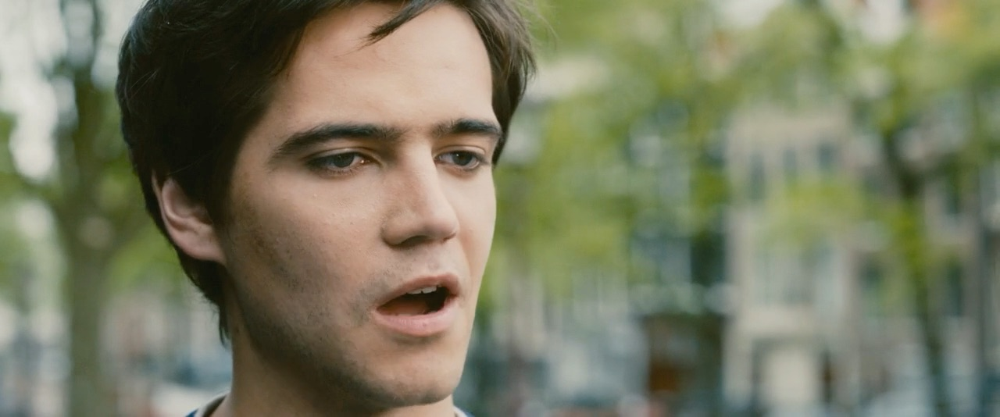
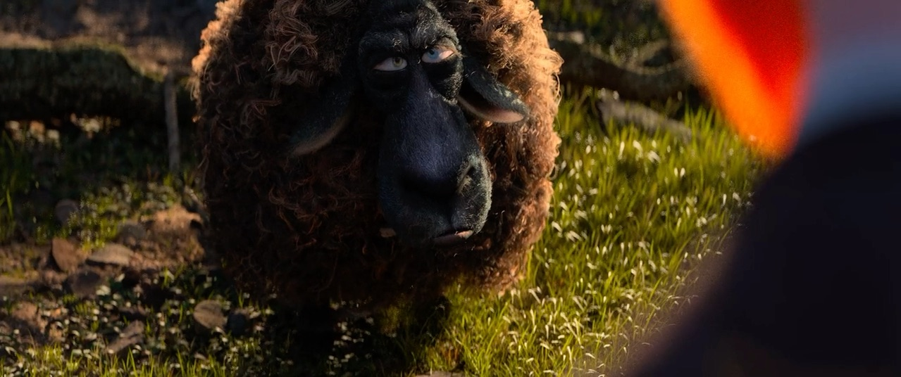
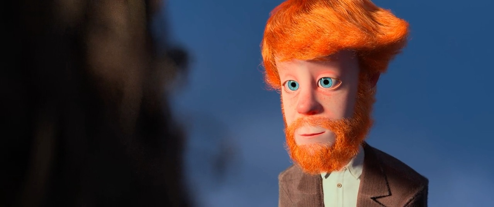
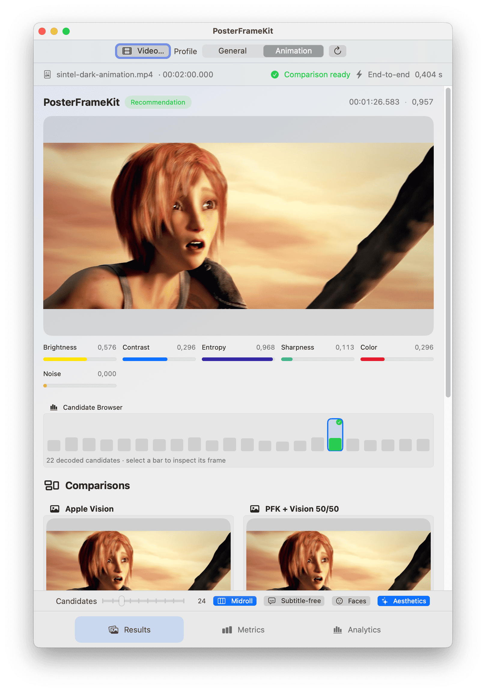

<p align="center">
  
</p>
<h1 align="center">PosterFrameKit</h1>

<p align="center">
  Select a strong poster frame from a video—locally, predictably, and with
  explainable results.
</p>

<p align="center">
  <a href="CHANGELOG.md"></a>
  <a href="https://github.com/MetaFlashApps/poster-frame-kit/actions/workflows/ci.yml"></a>
  <a href="Package.swift"></a>
  <a href="Package.swift"></a>
  <a href="Package.swift"></a>
  <a href="LICENSE"></a>
</p>

PosterFrameKit is a native Swift package for selecting one high-quality still
from a video on Apple platforms. It combines bounded sampling, deterministic
image metrics, and optional Apple Vision refinements without external package
dependencies or runtime services.

> [!IMPORTANT]
> `0.1.0` is the initial pre-1.0 release. Its API may change in later minor
> versions. Broader calibration and external integration feedback remain
> required before stable `1.0.0`; optional Vision refinements are best effort.

## Table of Contents

- [Installation](#installation)
- [Usage](#usage)
- [Results Gallery](#results-gallery)
- [Options](#options)
- [Platform targets](#platform-targets)
- [Development](#development)
- [Demo app](#demo-app)
- [Documentation](#documentation)
- [License](#license)

## Goals

- Pick one visually useful frame rather than generate a video summary.
- Stay deterministic and local, with no external package or runtime service.
- Support custom decoders through `PosterFrameSource`.
- Work especially well with animation while remaining useful for live action
  and screencasts.
- Explain every result through public metrics and a score.

## Installation

Add the package through Xcode using version `0.1.0`, or in `Package.swift`:

```swift
.package(
    url: "https://github.com/MetaFlashApps/poster-frame-kit.git",
    .upToNextMinor(from: "0.1.0")
)
```

This requirement accepts `0.1.x` updates without automatically adopting a
potentially source-breaking `0.2.0`. Track `main` only for development.

## Usage

```swift
import PosterFrameKit

var options = PosterFrameOptions(profile: .animation)
options.maximumFramesExamined = 40
options.excludedRanges = [0.46...0.54]
options.subtitleAvoidance = PosterFrameSubtitleOptions()
options.facePreference = PosterFrameFaceOptions()
options.aestheticPreference = PosterFrameAestheticOptions()
options.outputSize = CGSize(width: 640, height: 360)

let result = try await PosterFrameKit.bestFrame(
    in: videoURL,
    options: options
)
```

When a file may already carry deliberate cover art, check it before generating
a frame:

```swift
if let artwork = try await PosterFrameKit.embeddedArtwork(in: videoURL) {
    display(artwork)
} else {
    let result = try await PosterFrameKit.bestFrame(
        in: videoURL,
        options: options
    )
    display(result.image)
}
```

`embeddedArtwork(in:)` reads AVFoundation's common artwork metadata and returns
the first decodable image. It does not sample the video, apply options, or
manufacture scores and metrics for an image that was not selected from a
frame. Missing or malformed artwork returns `nil`; metadata-loading failures
and cancellation remain observable errors. Applications using custom
containers should inspect attachments through their container layer before
falling back to `bestFrame(from:options:)`.

`excludedRanges` can omit predictable title cards or anime midroll eyecatches
without changing the outer search range. The result contains a display-oriented
`CGImage`, the actual decoded `CMTime`, a normalized base score, optional
candidate adjustments, and public metrics for brightness, contrast, entropy,
sharpness, colorfulness, and visual noise.
Dense incoherent high-frequency patterns receive a bounded score penalty so
static or sensor noise cannot win solely by inflating entropy and sharpness.
Optional subtitle avoidance re-ranks only a small leading group using local
Vision text recognition in the lower third.
Optional face preference uses local Vision face detection on at most eight
leading candidates and adds a small, bounded composition bonus. A frame without
a detected face receives no penalty.
On macOS 15+, iOS 18+, tvOS 18+, and visionOS 2+, optional aesthetic preference
uses Apple Vision as the aesthetic base ranking for at most 24 leading
candidates. This is the recommended quality configuration on those systems;
older systems retain PosterFrameKit's deterministic ranking without failing.

## Results Gallery

The first public quality set compares an independently decoded fixed 50% frame
with PosterFrameKit's recommended 24-candidate quality configuration. These are
derived from checksum-locked, freely licensed 120-second fixtures; they are not
hand-picked frames.

| Fixture | Fixed 50% baseline | PosterFrameKit |
| --- | --- | --- |
| Morevna Demo |  |  |
| Big Buck Bunny |  |  |
| Sintel |  |  |
| Tears of Steel |  |  |
| Cosmos Laundromat |  |  |

The fixed midpoint decoded at `59.958 s`; PosterFrameKit selected `73.750 s`,
`108.000 s`, `86.583 s`, `86.583 s`, and `90.875 s`, respectively. See the
[quality evaluation](docs/quality-evaluation.md) for methodology and review,
and the [gallery attribution](docs/assets/results-gallery/README.md) for source
licenses and the exact reproduction command.

For custom decoders, implement `PosterFrameSource` and call
`bestFrame(from:options:)`. The shared sampling, analysis, and scoring path is
identical to the AVFoundation path. URL-based AVFoundation selection uses a
bounded internal decoder pool; custom sources keep their explicitly serialized
single-frame contract.

## Options

### `PosterFrameOptions`

| Property | Type | Description | Default |
| --- | --- | --- | --- |
| `searchRange` | `ClosedRange<Double>` | Inclusive normalized portion of the video to search. `0` is the beginning and `1` is the end. | `0.08...0.90` |
| `maximumFramesExamined` | `Int` | Largest number of candidate timestamps to request. Exclusions can reduce the number actually decoded. | `40` |
| `excludedRanges` | `[ClosedRange<Double>]` | Normalized portions omitted from candidate sampling, such as title cards or midroll eyecatches. | `[]` |
| `profile` | [`PosterFrameProfile`](#posterframeprofile) | Scoring strategy used to rank decoded frames. | `.general` |
| `subtitleAvoidance` | [`PosterFrameSubtitleOptions?`](#posterframesubtitleoptions) | Best-effort lower-third subtitle avoidance for a bounded leading candidate group. `nil` performs no text analysis. | `nil` |
| `facePreference` | [`PosterFrameFaceOptions?`](#posterframefaceoptions) | Best-effort preference for strong face composition in a bounded leading candidate group. `nil` performs no face detection. | `nil` |
| `aestheticPreference` | [`PosterFrameAestheticOptions?`](#posterframeaestheticoptions) | Best-effort Apple Vision aesthetics refinement for a bounded leading candidate group. `nil` performs no aesthetics analysis. | `nil` |
| `outputSize` | `CGSize?` | Maximum decoded pixel dimensions. Aspect ratio is preserved and smaller sources are not upscaled solely to fill the bounds. | `nil` |

PosterFrameKit validates and normalizes these values before accessing a video.
Search bounds are clamped to `0...1`; excluded ranges are intersected with that
interval, sorted, and merged. Invalid values throw
`PosterFrameError.invalidOptions`. Call `normalized()` directly when a custom
pipeline needs the same validated, canonical representation.

### `PosterFrameSubtitleOptions`

Subtitle avoidance is an optional candidate-refinement policy, independent of
the base profile weights. PosterFrameKit first ranks every sampled frame with
its normal metrics, retains only the leading group, and subtracts a bounded
penalty from candidates with subtitle-like lower-third text.

| Property | Type | Description | Default |
| --- | --- | --- | --- |
| `candidateCount` | `Int` | Maximum number of leading candidates inspected. Normalization bounds it by `maximumFramesExamined`; score-based early termination usually inspects fewer. | `8` |
| `maximumPenalty` | `Double` | Largest score reduction when subtitle likelihood is `1`. Must be finite and within `0...1`; `0` skips refinement work. | `0.08` |

The native analyzer starts with Vision's fast recognition in the bottom third.
If it finds no text but a cheap edge-band heuristic still looks suspicious, it
uses accurate recognition as a fallback. Analysis can stop early once a lower
base score can no longer beat the current adjusted winner. Any recognition
error discards the complete optional re-ranking; cancellation is propagated.
`PosterFrameResult.score` remains the base quality score,
`subtitlePenalty` reports the selected candidate's reduction, and
`adjustedScore` is the final ranking value.

This is deliberately best effort. Text outside the bottom third—including most
signs and title artwork—is not targeted. A sign, credit, or other text inside
the lower third can still look subtitle-like. The option is disabled by default
until broader freely reproducible calibration covers multiple genres. The
generated boundary and first paired live-action calibration cover 52 clean,
English/German outline, and boxed samples; their method, improvement, and
remaining risks are documented in
[Subtitle-Avoidance Calibration](docs/subtitle-calibration.md).

### `PosterFrameFaceOptions`

Face preference is an optional candidate-refinement policy, independent of the
base profile weights. PosterFrameKit uses Vision face rectangles and detector
confidence to reward a reliable, visible, usefully sized face near the central
composition. Multiple eligible faces receive a small capped group bonus. Tiny
detections, low-confidence observations, extreme close-ups, and invalid
rectangles receive no bonus; frames without a reliable face receive no
penalty.

| Property | Type | Description | Default |
| --- | --- | --- | --- |
| `candidateCount` | `Int` | Maximum number of leading candidates inspected. Normalization bounds it by `maximumFramesExamined`; score-based early termination usually inspects fewer. | `8` |
| `maximumBonus` | `Double` | Largest score increase for the strongest face composition. Must be finite and within `0...1`; `0` skips refinement work. | `0.04` |

The detector uses Vision face-rectangle revision 3, requires confidence of at
least `0.70`, and consumes the existing display-oriented pixel buffers, so
enabling the option does not decode the video again. Analysis stops once the
remaining candidate cannot overtake the current winner even with the maximum
bonus. A face-analysis error discards face bonuses while preserving the normal
ranking; cancellation is propagated.
`PosterFrameResult.faceCompositionBonus` exposes the winner's increase
separately.

This remains best effort. Apple's detector is reliable for many photographic
faces but can miss strongly stylized animation. The initial five-video
candidate-level evaluation and measured opt-in cost are documented in
[Face-Preference Calibration](docs/face-calibration.md); dedicated group,
extreme-close-up, and broader 2D-animation fixtures remain future work.

### `PosterFrameAestheticOptions`

Aesthetic preference is an optional final candidate refinement. On supported
systems, Apple Vision's revision-1 image-aesthetics score becomes the aesthetic
base for a bounded leading group. Earlier face bonuses and subtitle penalties
remain independent ranking adjustments.

| Property | Type | Description | Default |
| --- | --- | --- | --- |
| `candidateCount` | `Int` | Maximum number of leading candidates inspected. Normalization bounds it by `maximumFramesExamined`; score-based early termination can inspect fewer. | `24` |
| `maximumAdjustment` | `Double` | Largest absolute change allowed while aligning the base score with Vision's normalized aesthetics score. Must be finite and within `0...1`; `0` skips refinement work. | `1` |

The analyzer normalizes Vision's raw `-1...1` score to `0...1`, then records the
bounded difference from PosterFrameKit's base score as `aestheticAdjustment`.
This lets Vision lead aesthetic ordering while face and subtitle policies
continue to compose visibly. It reuses decoded buffers and does not
seek again. `aestheticScore` and `isUtilityFrame` preserve Vision's evidence;
there is no second hidden utility penalty.

The option requires macOS 15+, iOS 18+, tvOS 18+, or visionOS 2+. On earlier
systems, or if analysis fails, PosterFrameKit preserves the ranking produced by
the preceding stages. Cancellation is still propagated. The option remains
explicit because it adds OS-dependent work, but it is the recommended quality
setting on supported systems.

The default 24-candidate cap remains the conservative quality-first setting.
An initial five-video calibration found that an explicit cap of eight retained
four winners and produced one visually competitive alternative while reducing
the measured process-warm runtime by `19.2%` on Sintel. Latency-sensitive
callers can therefore use `PosterFrameAestheticOptions(candidateCount: 8)`;
PosterFrameKit does not silently trade shortlist breadth for speed. See
[Aesthetic Candidate-Cap Calibration](docs/aesthetic-calibration.md).

When multiple preferences are enabled, PosterFrameKit applies face bonuses,
then subtitle penalties, then aesthetic adjustments. A failure in an optional
Vision stage removes only that stage's adjustment.

### `PosterFrameProfile`

| Profile | Sharpness | Contrast | Entropy | Colorfulness | Demo | Description |
| --- | ---: | ---: | ---: | ---: | --- | --- |
| `.general` | `0.35` | `0.25` | `0.30` | `0.10` | Available | Balanced default for varied material. |
| `.animation` | `0.40` | `0.30` | `0.25` | `0.05` | Default | Favors crisp edges and controlled contrast in animation. |
| `.custom` | `*` | `*` | `*` | `*` | Not exposed | Uses caller-defined [`PosterFrameWeights`](#posterframeweights). |

\* Supplied by the caller through `PosterFrameWeights`.

### `PosterFrameWeights`

Use `PosterFrameWeights` as the associated value of `.custom`. Relative values
are allowed: normalization scales all four weights to a combined total of `1`
while preserving their proportions.

| Property | Type | Description | Default |
| --- | --- | --- | --- |
| `sharpness` | `Double` | Relative contribution from edge sharpness. | Required |
| `contrast` | `Double` | Relative contribution from normalized luma deviation. | Required |
| `entropy` | `Double` | Relative contribution from luma entropy trusted by coherent edge structure. | Required |
| `colorfulness` | `Double` | Relative contribution from color intensity and variation. | Required |

Weights must be finite and nonnegative, with at least one positive value.
The public raw entropy metric remains unchanged; scoring limits only its
contribution when a frame has almost no coherent edge structure.

## Platform targets


Performance work currently targets macOS. Other platforms remain part of the
package contract and must be covered before `1.0.0`.

## Development

```bash
swift build
swift test
Scripts/check-release-hygiene.sh
```

GitHub Actions runs the package and Demo tests, release builds, repository
hygiene check, quality-catalog schema tests, DocC build, and generic compile
checks for every supported Apple platform. A dedicated iOS example app also
offers Photos- and Files-based video import with the selected image and public
metrics, and runs public pixel-buffer evaluation plus generated H.264 selection
in an iPhone Simulator. See
[Continuous Integration](docs/continuous-integration.md) for the exact gates
and their local equivalents.

To generate SwiftPM's LLVM coverage report for the package:

```bash
swift test --enable-code-coverage
swift test --show-codecov-path
swift test --package-path Examples/PosterFrameDemo --enable-code-coverage
swift test --package-path Examples/PosterFrameDemo --show-codecov-path
```

Library coverage is evaluated over `Sources/PosterFrameKit`. SwiftUI `body`
builders generate substantial compiler-owned code, so Demo quality is judged
by unit coverage of its state and ranking logic plus the generated-video
end-to-end workflow, not by forcing declarative view builders to a misleading
line percentage.

### Benchmarks

The package includes a dependency-free release benchmark that generates its
own deterministic 30-second H.264 fixture and records direct stage timings,
end-to-end runtime, selected result, and selection-scoped resident memory in
isolated worker processes. Process-cold and process-warm runs are reported
separately; the operating system filesystem cache remains explicitly
uncontrolled:

```bash
arch -arm64 swift run -c release PosterFrameKitBenchmark \
  --label local \
  --candidates 40 \
  --exclude-midroll \
  --lanes 1,2,3,4 \
  --cold-runs 3 \
  --warm-runs 5 \
  --output Benchmarks/Reports/local.json
```

Use `--generated-fixture subtitles --avoid-subtitles` to benchmark optional
subtitle refinement. Checked-in reports and their exact measurement semantics
are documented in [Benchmarks/README.md](Benchmarks/README.md); fixture-specific
numbers are not universal performance promises.

Use `--prefer-aesthetics --aesthetic-candidates 24` for a paired measurement of
the recommended Vision-first refinement on supported systems. The measured
eight-candidate latency-first alternative and its quality boundary are covered
in [Aesthetic Candidate-Cap Calibration](docs/aesthetic-calibration.md).

The ordered optimization experiments, required evidence, and stop conditions
through `1.0.0` live in the [Performance Roadmap](docs/performance-roadmap.md).

Quality calibration uses the versioned catalog in
[Benchmarks/Fixtures](Benchmarks/Fixtures/README.md). It combines five
checksum-locked, freely licensed animation/live-action sources with five
deterministic generated edge cases. The fetcher creates silent 120-second H.264
working clips from downloaded sources; the Swift harness generates synthetic
fixtures on demand. No media is added to the package:

```bash
Scripts/fetch-benchmark-fixtures.py
Scripts/fetch-benchmark-fixtures.py --verify-only
arch -arm64 swift run -c release PosterFrameKitQualityBenchmark --candidates 24
```

Large HDR masters such as Netflix Meridian and Sol Levante are documented as
deferred extended fixtures and are not part of the default download.

### Demo app



Demo footage: [*Sintel*](https://durian.blender.org/) © Blender Foundation,
licensed under [CC BY 3.0](https://creativecommons.org/licenses/by/3.0/).

`Examples/PosterFrameDemo` is a standalone macOS SwiftUI executable that uses
the package through a local SwiftPM dependency. It compares the neutral frame
at 50%, PosterFrameKit, Apple Vision Image Aesthetics on macOS 15+, and a 50/50
hybrid ranking. It starts analysis on selection, exposes the optional policies,
automatically refreshes after option changes, and provides a selectable
candidate-score browser. A persistent adaptive settings bar keeps the candidate
budget and selection preferences available across Results, Metrics, and
Analytics. Its fixed 16:9 primary result and adaptive comparison grid keep the
visual hierarchy stable, while end-to-end timing, visual quality metrics, and
performance analytics remain in dedicated views. Its provisional default is
24 candidates; the package default remains unchanged.

```bash
swift run --package-path Examples/PosterFrameDemo
```

You can also open `Examples/PosterFrameDemo/Package.swift` directly in Xcode.
The demo has no Python or OpenCV dependency.

See [PosterFrameDemo](Examples/PosterFrameDemo/README.md) for the complete
workflow and timing definitions.

### DocC

The DocC catalog covers selection, metrics, options, and custom frame sources.
Build it in Xcode with Product > Build Documentation or from the command line:

```bash
xcodebuild docbuild -scheme PosterFrameKit -destination 'generic/platform=macOS'
```

The [online API reference](https://metaflashapps.github.io/poster-frame-kit/documentation/posterframekit/)
is deployed by the documentation workflow after a GitHub release is published.
For a local static-site build, run `Scripts/build-documentation.sh`. See
[documentation publishing](docs/continuous-integration.md#documentation-publishing)
for GitHub Pages setup and local preview instructions.

## Documentation

- [Concept](docs/concept.md)
- [Initial quality evaluation](docs/quality-evaluation.md)
- [Aesthetic candidate-cap calibration](docs/aesthetic-calibration.md)
- [Automatic profile research plan](docs/automatic-profile-research.md)
- [Roadmap](docs/roadmap.md)
- [Performance roadmap](docs/performance-roadmap.md)
- [Public API review](docs/public-api-review.md)
- [Continuous integration](docs/continuous-integration.md)
- [Release hygiene audit](docs/release-hygiene.md)
- [Version 0.1.0 release checklist](docs/version-0.1.0.md)
- [Third-party notices](THIRD_PARTY_NOTICES.md)
- [Contributing](CONTRIBUTING.md)
- [Security policy](SECURITY.md)
- [Heiter integration](docs/heiter-integration.md)
- [Research findings and decision record](docs/research-findings-2026-08.md)
- [Version 1.0.0 definition](docs/version-1.0.0.md)
- [Demo app](Examples/PosterFrameDemo/README.md)
- [iOS example app](Examples/PosterFrameIOSExample/README.md)
- [Changelog](CHANGELOG.md)

## License

PosterFrameKit is available under the MIT License.
