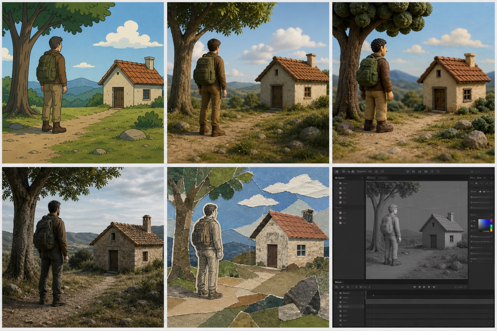
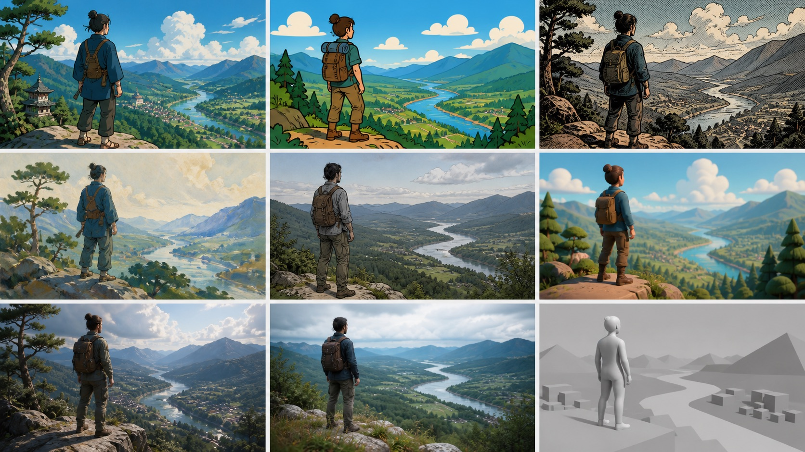
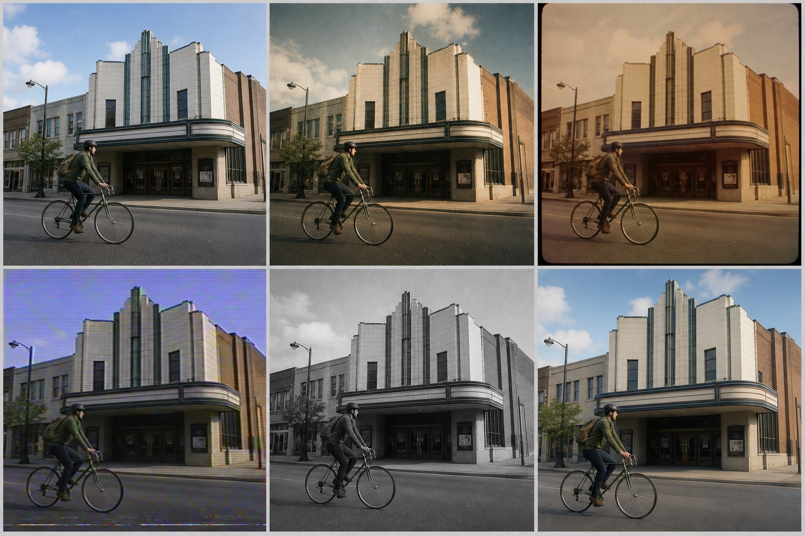
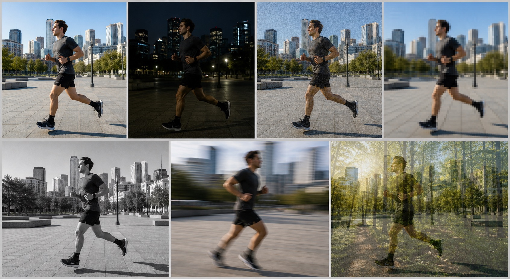

# Automatic Profile Taxonomy – Visual Examples

These AI-generated contact sheets illustrate the controlled taxonomy proposed
in [`automatic-profile-research.md`](../../automatic-profile-research.md).
Read every sheet from left to right and then from top to bottom.

The images are explanatory documentation only. They must not be used as model
training data, quality fixtures, test inputs, or benchmark evidence. Synthetic
examples are too regular to represent the variation found in independently
produced videos.

## Rendering domain

| Position | Tag |
| --- | --- |
| Row 1, column 1 | `two-dimensional-animation` |
| Row 1, column 2 | `three-dimensional-animation` |
| Row 1, column 3 | `stop-motion` |
| Row 2, column 1 | `live-action` |
| Row 2, column 2 | `mixed-media` |
| Row 2, column 3 | `screen-content` |

## Visual style

| Position | Tag |
| --- | --- |
| Row 1, column 1 | `anime` |
| Row 1, column 2 | `western-cartoon` |
| Row 1, column 3 | `comic` |
| Row 2, column 1 | `painterly` |
| Row 2, column 2 | `rotoscoped` |
| Row 2, column 3 | `stylized-3d` |
| Row 3, column 1 | `photorealistic-3d` |
| Row 3, column 2 | `photographic` |
| Row 3, column 3 | `none` |

`none` means that no controlled visual-style tag applies. Its deliberately
neutral panel is an illustration of that absence, not a style to detect.

## Capture and source character

| Position | Tag |
| --- | --- |
| Row 1, column 1 | `modern-digital` |
| Row 1, column 2 | `film-scan` |
| Row 1, column 3 | `retro-telecine` |
| Row 2, column 1 | `analog-video` |
| Row 2, column 2 | `restored-archive` |
| Row 2, column 3 | `synthetic` |

The source tags describe the visible character of the material, not a claim
about its actual capture hardware or production history.

## Evaluation conditions – technical

| Position | Tag |
| --- | --- |
| Row 1, column 1 | `bright` |
| Row 1, column 2 | `dark` |
| Row 1, column 3 | `grainy` |
| Row 1, column 4 | `low-resolution` |
| Row 2, column 1 | `monochrome` |
| Row 2, column 2 | `high-motion` |
| Row 2, column 3 | `crossfades` |

## Evaluation conditions – semantic

| Position | Tag |
| --- | --- |
| Row 1, column 1 | `faces` |
| Row 1, column 2 | `groups` |
| Row 1, column 3 | `no-faces` |
| Row 2, column 1 | `subtitles` |
| Row 2, column 2 | `credits` |
| Row 2, column 3 | `title-cards` |

## Generation notes

The sheets were generated with the built-in image generator using five
separate prompts. Each prompt requested an exact contact-sheet grid, original
generic subjects, the category treatments in the order documented above, and
no brands, copyrighted characters, franchise styles, or watermarks. Repeated
scenes were requested where useful so that the intended category difference
is easier to compare.
